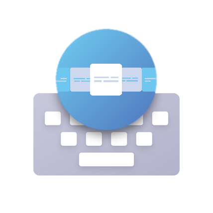

<h1 align="center">
   
    
   
  CoverflowKeyboard
</h1>

  
  
  
  
   

  This repository contains the <strong>CoverflowKeyboard</strong> source code.
  CoverflowKeyboard enables you to create creative and fancy Keyboard coverflows, with multiple styling and sizing options.

## Table of contents

  * [WIP ...](#wip)
  * [Contributing](#contributing)
  * [License](#license)
  * [Special thanks](#special-thanks)

## Contributing

You may contribute in several ways like creating new features, fixing bugs, improving documentation and examples
or translating any document here to your language. To find out more check out the [CONTRIBUTING.md](CONTRIBUTING.md).

## License

[MIT](LICENSE) - David Bosun-Arebuwa - 2020

## Special thanks

* [undeaD_D](https://github.com/undeaDD);
